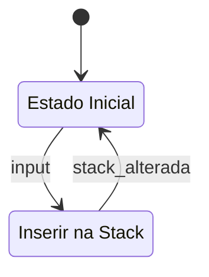

# Most Recent Used Module

A SystemVerilog description for a MRU

## States

## How a MRU works

The MRU saves the time when a input is pressed and, after the limit size is reached, it erases the input with the most recent time

## PINs in this description

- clk : Clock
- rst : Reset
- b1, b2, b3, b4, b5 : The inputs, here represented as 5 buttons
- l1, l2, l3, l4, l5 : LEDs to show if a input is active or not, if a LED is off then it means that it is not active

# IMPORTANT IF YOU WANT TO TEST!

Because this LFU waits for 1 second in a 50MHz clock, you will have to wait quite some time, prevent this you can change the constant variable used in the file timer.sv

- Use the constant TIME_50MHz for the 1 sec time
- Use the constant TIME_SIM for 5 clock cycles (used for simulation)
